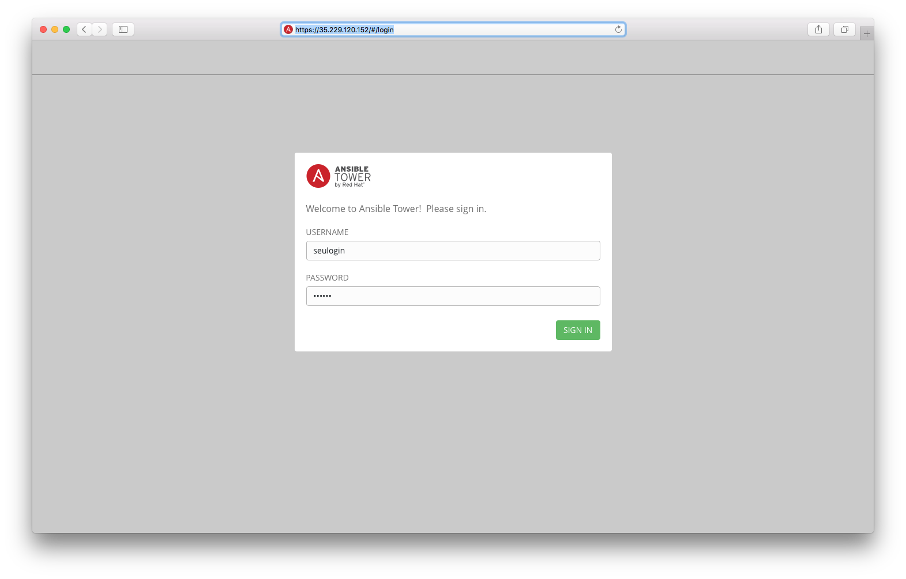
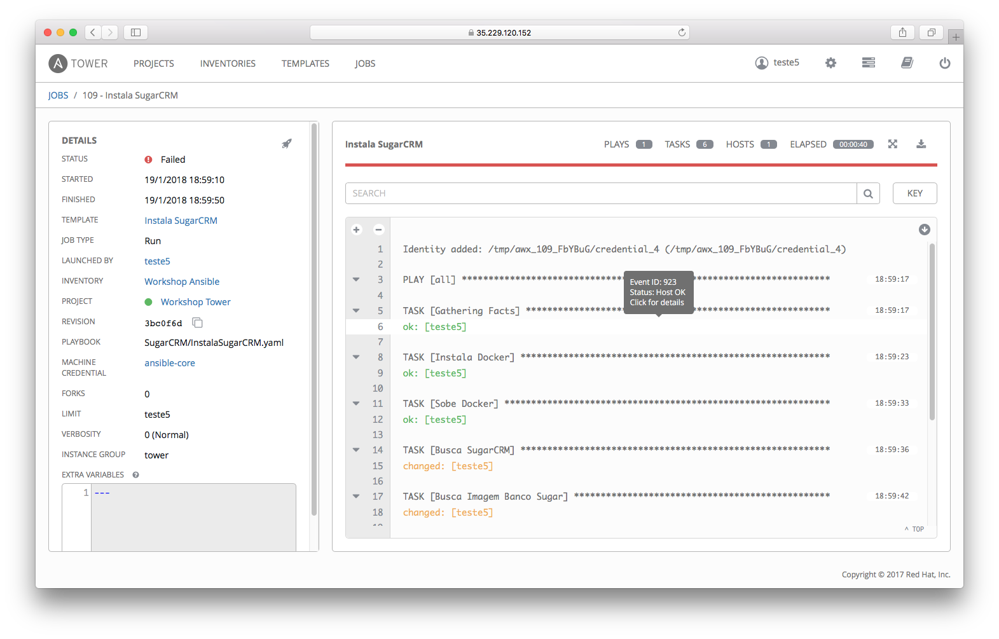

= Workshop Ansible Core and Tower
= Versao 1.0
= Parte 1 - Ansible core

= Introdução

Bem-vindo ao nosso laboratório de Ansible-Core. Você deve ter recebido um e-mail nosso com dados de acesso ao laborátorio.

Abra esse e-mail e siga os passos a seguir.

==== Antes de acessar o laboratório verifique os itens abaixo:

* Notebook com acesso à Internet
* Navagador de Internet com Firefox ou Google Chrome
* 4 GB de memória RAM
* Linux: Centos ou RHEL (virtualizado ou físico)

==== Testando tudo

Agora você tem os dados do ambiente e notebook funcionando. Faça um teste e tente logar em cada servidor usando putty ou ssh (linux nativo)

=== Topologia do laboratório

.Tabela dos servidores e funcionalidades
|===
|Servidor|Função|S.O
|<ip fornecido por email>|Ansible engine e Servidor de aplicação|Centos 7
|<login fornecido>-server1|Servidor 1 para automacao| Centos 7
|<login fornecido>-server2|Servidor 2 para automacao| Centos 7
|===

.Tabela de usuários e senhas
|===
|Usuário|Senha|Função
|<login fornecido>|<chave privada>|login ssh
|ansible-core|<chave privada>|usuario que roda playbooks
|<login fornecido>|redhat|Ansible Tower
|===

== Let's Rock on Ansible Core!!

==== LAB01 - Instalação Ansible-Core

Primeiro passo é acessar o servidor Ansible-Engine e instale os pacotes relacionados ao Ansible-Core.

===== Conectando ao Servidor
 ssh -i <chave privada> <usuario da chave>@<ip fornecido da instancia>

===== Instalação do Ansible Core passo - passo
 #(Opcional) yum  localinstall -y https://mirror.cedia.org.ec/epel/7/x86_64/Packages/e/epel-release-7-11.noarch.rpm <1>
 sudo yum install -y ansible  <2>

<1> Instalação do repositório epel
<2> Instalação do Ansible Core

==== LAB02 - Configurando um inventário manualmente

Neste laborátorio iremos criar um inventário para nosso laboratório

===== Usando usuario ansible-core

 sudo su - ansible-core
 cd /ansible-core

===== Criando inventário

 vi inventario.ini

===== Exemplo de inventário para este laboratório

 [all:vars]
  ansible_ssh_user=ansible-core
  ansible_ssh_private_key_file=/ansible-core/chave
 [web]
 <login fornecido>-server1
 [banco]
 <login fornecido>-server2

==== LAB03 - Módulos para execução de comandos

===== Utilizando o comando externo - uptime

 ansible all -i inventario.ini -m command -a "uptime"

===== Instalando um pacote diretamente num grupo de hosts

 ansible web -s -i inventario.ini -m yum -a "name=httpd state=present"

===== Resolve problema de repositorio remoto

 ansible-playbook /ansible-core/fix_repo_local.yml -i inventario.ini

===== Repete comando de instalacao

 ansible web -s -i inventario.ini -m yum -a "name=httpd state=present"

===== Inicializando serviço http via comando

 ansible web -s -i inventario.ini -m service -a "name=httpd enabled=yes state=started"

===== Usando o módulo ping

 ansible -i inventario.ini all -m ping <1>

<1> É possível testar se todos os servidores registrados dentro do inventário estão funcionais a nível de rede

===== Validando  o nível de privilégio do usuário <login fornecido>

 ansible -i inventario.ini all -m command -a id -b <1>

<1> O resultado da ação do comando Ansible terá como saída qual nível de privilégio

=== Desafio

1. Utilize o modulo ping para pingar todos os servidores
2. Instale o telnet apenas nos servidores web
3. Defina o Selinux para permissive:

=== Resposta do desafio
1. Utilize o modulo ping para pingar todos os servidores: *__ansible -i inventario.ini all -m ping__*
2. Instale o telnet apenas nos servidores web: *__ansible web -s -i inventario.ini -m yum -a "name=telnet state=present"__*
3. Defina o Selinux para permissive: *__ansible all -s -i inventario.ini -m command -a  "setenforce permissive"__*
4. Comando para listar todos os serviços:  *__ansible all -i inventario.ini -m command -a "systemctl status"__*

==== LAB04 - Construindo primeiro playbook

===== Criando o primeiro playbook
  vi /ansible-core/primeiroplaybook.yaml <1>

<1> Crie o arquivo utilizando vim que será utilizado como ferramenta para escrever os playbook

===== Utilize o modelo abaixo como padrão
------
---     <6>
- name: Primeiro playbook
  hosts: web <1>
  become: yes
  vars:
  remote_user: ansible-core <2>

  tasks:
  - name: Instala a ferramenta net-tools <3>
    yum: name=net-tools state=latest <4> <5>

------

<1> Nome do grupo de hosts
<2> Usuário que irá realizar a operação
<3> Nome da tarefa
<4> Modulo yum sendo utilizado para instalalação do pacote net-tools na última versão
<5> Nunca utilize TAB apenas espaço
<6> Sempre inicie o seu script ansible com ---

===== Salve o seu playbook
Utilizando o vim salve todas as alterações do script ansible e execute a sequencia de comandos para salvar e  sair do vim ':wq!'

===== Valide se seu playbook tem alguma erro
 ansible-playbook -C -i inventario.ini  primeiroplaybook.yaml

===== Execute o playbook

 ansible-playbook -i inventario.ini  primeiroplaybook.yaml

===== Utilizando loop

Utilizando o vim crie o  segundo playbook com o nome _segundoplaybook.yaml_

 vi /ansible-core/segundoplaybook.yaml
------
---
- name: Segundo Playbook - trabalhando com loop
  hosts: web
  remote_user: ansible-core
  become: yes
  gather_facts: no
  vars:
   state: latest

  tasks:
  - name: Instalando Apache e PHP
    yum: name={{ item }} state={{ state }}
    with_items:
      - httpd
      - php
------

====== Execute o playbook

  ansible-playbook -i inventario.ini  segundoplaybook.yaml

==== LAB05 - Trabalhando com Handlers "Manipuladores"

*O que são  Handlers ? Qual é sua importância ?*

Semelhante a uma tarefa, exceto que os handlers executam somente em resposta a uma tarefa configurada para notificar o handler na mudança de estado.

===== Exemplo de um playbook que utiliza handlers para gerenciar o serviço do Apache
 vi /ansible-core/terceiroplaybook.yaml

------
---
- name: Trabalhando com Handlers
  hosts: web
  remote_user: ansible-core
  become: yes

  tasks:
   - name: Testando handlers do Apache
     yum: name={{ item }} state=installed
     with_items:
       - httpd
       - memcached
     notify: Restart Apache

   - template: src=templates/httpd.conf.j2 dest=/etc/httpd/conf/httpd.conf
     notify: Restart Apache

  handlers:
   - name: Restart Apache
     service: name=httpd state=restarted
------

Utilizando o vim crie o  terceiro playbook utilizando o modelo acima e  com o nome *_terceiroplaybook.yaml_*

====== Execute o playbook

  ansible-playbook -i inventario.ini  terceiroplaybook.yaml

==== LAB06 - Trabalhando com TAGS

*Por que devo usar Tags ?*

Se você tiver um grande playbook, o uso de TAGs tornar-se útil para executar uma parte específica do playbook, sem executar todo o playbook.

 vi /ansible-core/quartoplaybook.yaml

------

---
- name: Trabalhando com tags
  hosts: web
  remote_user: ansible-core
  become: yes

  tasks:
  - name: Executando tag packages
    yum: name={{ item }} state=installed
    with_items:
      - httpd
      - memcached
    tags:
      - packages

  - name: "Executando Tag Configuration"
    template: src=templates/httpd.conf.j2 dest=/etc/foo.conf
    tags:
      - configuration
------

===== Executando playbook com tags

Executando apenas a tag configuration

 ansible-playbook -i inventario.ini  quartoplaybook.yaml --tags "configuration"

Executando apenas a tag notification

 ansible-playbook -i inventario.ini  quartoplaybook.yaml --skip-tags "notification"

===== Executando tags padrão do Ansible

 ansible-playbook example.yaml --tags “tagged” <1>
 ansible-playbook example.yaml --tags “untagged” <2>
 ansible-playbook example.yaml --tags “all” <2>

<1> Será executada todas as tarefas que tenham uma tag amarrada
<2> Será executada todas as tarefas sem tag
<3> Executa todas as tarefas independente da tag

==== LAB07 - Trabalhando com condicional

*Quando devo utilizar condicional ?*

O uso de condicionais se da quando temos situações onde não sabemos exatamente qual sistema ou condicação exata que será encontrada. +

Neste caso o condicacional consegue aplicar uma condicação para validar se o alvo condiz com contexto do playbook e se combinar, executar o restante do playbook.

 vi /ansible-core/quintoplaybook.yaml

----
---
- name: Trabalhando com Condicional
  hosts: web
  remote_user: ansible-core
  become: yes

  tasks:
  - name: Remove Apache
    yum: name=httpd state=removed
    when: ansible_os_family == "RedHat"

----

.Valide com comando

 ansible-playbook -i inventario.ini  quintoplaybook.yaml

Desafio: Execute um playbook que rode apenas em Centos. Dica:
http://docs.ansible.com/ansible/latest/playbooks_conditionals.html

==== LAB08 - Trabalhando com com saída de comandos

 vi /ansible-core/sextoplaybook.yaml

------
---
- name: Trabalhando com  saida de comandos
  hosts: web
  remote_user: ansible-core
  become: yes

  tasks:
  - name: Saida do comando httpd
    shell: httpd -v|grep version|awk '{print $3}'|cut -f2 -d'/'
    register: result

  - debug: var=result
------
===== Testando saída de comando

====== Execute o playbook

 ansible-playbook -i inventario.ini  sextoplaybook.yaml

==== LAB09 - Ignorando erros

 vi /ansible-core/setimoplaybook.yaml

-----
---
- name: Ignorando errors
  hosts: web
  remote_user: ansible-core
  become: yes

  tasks:

  - name: ping host
    command: ping -c1 www.uolbbb.com.jp
    ignore_errors: yes

  - name: remove apache mesmo depois do uolbbb.com.jp nao pingar
    yum: name=httpd state=absent

-----

====== Execute o playbook

 ansible-playbook -i inventario.ini  setimoplaybook.yaml

==== LAB10 - Tratando arquivos

Imagine uma situação onde você precisa alterar uma única linha de um arquivo de configuração em mais de 100 servidores, complicado ?  ++++

 vi /ansible-core/oitavoplaybook.yaml

----
---
- name: Tratando arquivos Selinux e HTTPD
  hosts: web
  remote_user: ansible-core
  become: yes

  tasks:
  - name: Tratando o arquivo de configuração selinux
    lineinfile:
     dest: /etc/selinux/config
     regexp: "^SELINUX="  <1>
     line: "SELINUX=enforcing"

  - name: Tratando o arquivo de configuração httpd
    lineinfile:
     dest: /etc/httpd/conf/httpd.conf
     regexp: "^Listen " <2>
     insertafter: "^#Listen "
     line: "Listen 8080"

----

<1> Abre o arquivo  /etc/selinux/config e altera a linha para SELINUX=enforcing
<2> Abre o arquivo  /etc/http/conf/httpd.conf e altera a linha para Listen 8080

====== Execute o playbook

    ansible-playbook -i inventario.ini  oitavoplaybook.yaml

==== LAB11 - Trabalhando com variáveis

Ansible não é uma linguagem de programação, mas possui vários recursos de linguagem de programação, e uma das mais importantes é o uso variáveis.

===== Exemplo no uso de variáveis no Ansible

 vi /ansible-core/nonoplaybook.yaml

-----
---
- name: Trabalhando com variaveis
  hosts: web
  remote_user: ansible-core
  become: yes

  tasks:
  - name: Show hostvars[inventory_hostname]
    debug: var=hostvars[inventory_hostname]

  - name: Show ansible_ssh_host variable in hostvars
    debug: var=hostvars[inventory_hostname].ansible_ssh_host

  - name: Show group_names
    debug: var=group_names

  - name: Show groups
    debug: var=groups

-----

====== Execute o playbook

    ansible-playbook -i inventario.ini  nonoplaybook.yaml

==== LAB12 - Trabalhando com templates

Se você fez a programação na Web, provavelmente usou um sistema de modelo para gerar HTML. Caso não tenha, um modelo é apenas um arquivo de texto que possui sintaxe especial para especificar variáveis que devem ser substituídas por valores. +

Se você já recebeu um email automatizado de uma empresa, provavelmente está usando um modelo de e-mail. ++++

Ansible usa o mecanismo de modelo *_Jinja2_* para implementar modelos +

 vi /ansible-core/decimoplaybook.yaml

----
---
- name: Trabalhando com template jinja2
  hosts: web
  remote_user: ansible-core
  become: yes
  vars: <4>
    http_port: 80
    max_clients: 200
  remote_user: root

  tasks:
  - name: Valida que o Apache esteja na última versão
    yum: name=httpd state=latest <3>

  - name: Substituia o arquivo de configuração httd.conf <2>
    template: src=/ansible-core/templates/httpd.conf.j2 dest=/etc/httpd/httpd.conf <1>
    notify:
    - restart apache

  - name: ensure apache is running (and enable it at boot)
    service: name=httpd state=started enabled=yes

  handlers:
    - name: restart apache
      service: name=httpd state=restarted <5>
----

<1> Ansible copia arquivo /srv/httpd.j2 para /etc/httpd.conf
<2> Utilize as variaveis substituindo o arquivo de configuração /etc/http/httpd.conf
<3> Valida que o pacote httpd na última versão
<4> Variáveis que serão utilizada na substituição de vários parametros do arquivo de configuração "httpd.conf"
<5> Este handlers garante que o serviço httpd será reinciado

====== Execute o playbook

    ansible-playbook -i inventario.ini  decimoplaybook.yaml

== Let's Rock on Ansible Tower!!

==== LAB01 - Acessando o Tower

Acesse: https://35.229.120.152
Login: <login fornecido>
Senha: redhat

==== LAB02 - Controle de Permissões

====== Controle granular de permissoes
Ao navegar pelas abas, perceberá que seu usuário ainda não possui acesso a projetos, inventários e templates. Observe o administrador dando permissões e como elas afetam sua visualização imediatamente.

image::images/AnsibleCoreAndTower-1c48d.png[]

==== LAB03 - Trabalhando em Equipe

Então, escolha o seu destino:

==== LAB04 - Rodando Jobs

Depois de escolher sua equipe, clique em "Templates". Voce verá a lista de Jobs que sua equipe tem permissão para executar.

image::images/AnsibleCoreAndTower-63866.png[]

Clique no ícone do "foguete" e preencha o campo limit com o seu login e clique em "Launch"

image::images/AnsibleCoreAndTower-a9e1c.png[]

==== LAB05 - Auditoria

Acompanhe o resultado dos comandos do playbook.

-----
-----
